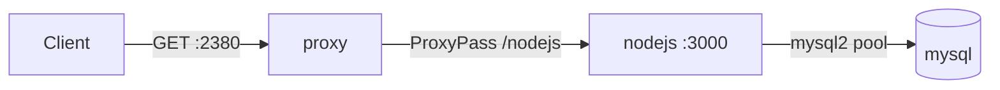
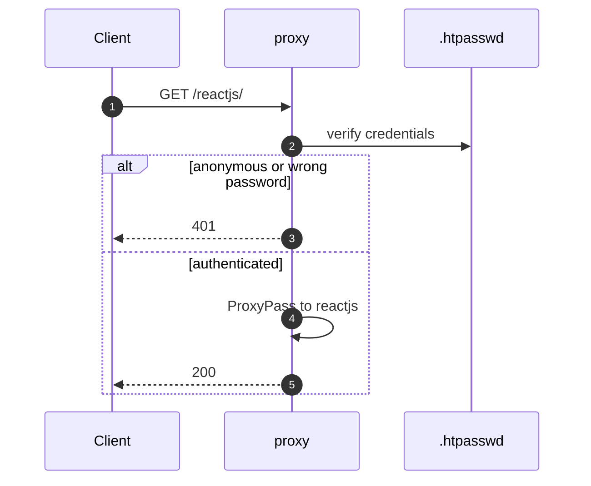
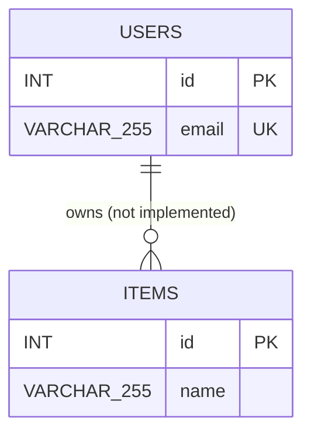

# AGENTS.md

Prototype: Apache reverse proxy acting as the sole gateway/auth layer in front of a
container cluster. `proxy -> {reactjs, nodejs, pma}`, `nodejs -> mysql`, `pma -> mysql`.

## Per-change checklist (all five, every change)

1. `codebase/` — update the affected service's code.
2. `docbase/` — update `TOCTREE.md` + the relevant `docbase/doc/*.md`.
3. `README.md` — must link/reference `docbase/TOCTREE.md`.
4. `CHANGELOG.md` — new entry, version `major.minor.patch`.
5. Git: branch `dev-001`, commit with `major.minor.patch` as the **subject** and a
   descriptive body, then `git push origin dev-001`.

Never commit directly to `dev` or `main` — CI auto-merges upward.

## Layout

```
codebase/                 everything runnable
  docker-compose.yml
  .env.example            copy to .env; .env is gitignored
  apache/ mysql/ nodejs/ reactjs/
docbase/                  all documentation
  TOCTREE.md
  doc/{PRD,SRS,ProjectCharter,ADR,Architecture,API,Schema,ERD,QuickStart,RTM,CRM,Configuration&Settings}.md
.github/workflows/        the single pipeline
README.md CHANGELOG.md AGENTS.md LICENSE .gitignore
```

`codebase/` is the single root of everything executable. Nothing runnable may be
added under `docbase/`, and nothing runnable lives at the repo root.

Two things bite after any move in or out of `codebase/`:

- The four `build:` paths (`./apache` etc.) and the bind mounts
  (`./mysql/data`, `./mysql/init.sql`) in `codebase/docker-compose.yml` are
  resolved **relative to the Compose file**, not the repo root. If the Compose
  file moves, these need no change; if a service directory moves independently,
  they do.
- Compose resolves the default env file from the project directory, which
  defaults to the directory holding the Compose file. Invoke it from inside
  `codebase/` (CI uses a job-level `working-directory: codebase`) or pass
  `--project-directory codebase`, or `.env` is silently not found and every
  `${MYSQL_*}` expands to empty.

`.gitignore` is slash-sensitive: `mysql/data` would be anchored to the repo root
and stop matching `codebase/mysql/data`, so it is written `**/mysql/data`. A
pattern with no slash, like `.env`, matches at any depth.

## Branches / CI

**One workflow, one trigger.** `.github/workflows/pipeline.yml` is the only workflow
and fires only on a push to `dev-001`. Every hop is a `needs:` job inside one run:

| # | Job | Runs on |
|---|---|---|
| 1 | `merge_dev_001_to_dev` | ubuntu-latest |
| 2 | `merge_dev_to_main` | ubuntu-latest |
| 3 | `verify` | ubuntu-latest |
| 4 | `pages` | ubuntu-latest, `if: always()` |

- Do **not** add a second workflow or a `push:` trigger on `dev`/`main`. The merges
  used to depend on a push re-triggering the workflow; chaining with `needs:` means
  one run covers the whole promotion. Adding a `main` trigger would double-merge.
- The old `if: github.ref == ...` guards on the merge jobs are **gone and must stay
  gone** — the run's ref is `dev-001` for all four jobs.
- `merge_dev_to_main` checks out `dev`, not the triggering commit, because job 1 has
  already pushed this run's changes there. `verify` checks out `main` so it tests
  the state that would be released, and passes that SHA to `pages` as an output.
- `concurrency: pipeline-dev-001` with `cancel-in-progress: false` — two runs must
  never interleave their merges.
- The merge jobs push with `secrets.GIT_PUSH_TOKEN || github.token`. A PAT is
  **optional** — it is only needed when `dev` or `main` has branch protection,
  since `GITHUB_TOKEN` cannot write to protected branches. Do not make it
  mandatory again: an unset secret resolves to an empty string, `actions/checkout`
  then configures `origin` with no credentials, and every push dies with
  `could not read Username for 'https://github.com': terminal prompts disabled`.
  The first job warns when it is falling back, and both merge steps emit a
  specific `::error::` if a push is rejected.
- `verify` needs **no secrets**. Compose substitutes `${MYSQL_*}` from the process
  environment, so the job sets throwaway values in its `env:` block and never writes
  a `.env` file. MySQL data is destroyed at job end.
- `verify` appends a `ci-user` to `apache/.htpasswd` **before** `docker compose
  build`, because `apache/Dockerfile` `COPY`s that file. Those relative paths are
  correct: the job sets `working-directory: codebase`. It uses `htpasswd -bB`
  without `-c` — with `-c` the committed `admin` entry would be destroyed. CI can
  only authenticate as the throwaway user; the real `admin` password is unknown to it.
- `verify` waits for readiness with `docker compose ps --services --all`. The
  `--all` is load-bearing: `docker compose ps` lists only *running* containers by
  default, so without it the "running" and "total" counts are computed from the same
  set, the equality holds on the first attempt, and the wait can never fail.
- The auth assertions are **asymmetric on purpose**: `/reactjs/` must be `401`
  anonymously and `200` authenticated, while `/pma/` and `/nodejs/` are asserted
  `200` anonymously to record the current unauthenticated state. When auth is
  extended to those paths, flip those two to `401`.
- `docker-compose.yml` declares the network `external: true`, so Compose will not
  create it. `verify` creates it explicitly before building. Any new runner or
  machine needs the same step.
- `pages` needs `pages: write` + `id-token: write` on top of `contents: write`.
  It probes the Pages API first and only calls `deploy-pages` when Pages is
  enabled, because the deploy returns a hard 404 otherwise. That step is
  `continue-on-error: true` on purpose: a status page is a courtesy, and it must
  not mark a run red when the merges and the verification passed. An unconfigured
  Pages site only produces a warning. Its heredoc in `run: |` relies on the `HTML`
  terminator sitting at the same indent as the body; if you edit the HTML, keep
  that alignment or the block scalar breaks.

**GitHub Pages is not used to host the containers and cannot be.** It is static file
hosting with no container runtime, so it can never `docker compose up`. The `pages`
job only renders a status page. Terraform is also not an answer — it provisions
infrastructure, it does not host anything.

## Build & run

Prerequisites, in order:

```shell
# 1. External network MUST exist first — compose declares it `external: true` and fails without it.
docker network create -d bridge --subnet 172.70.0.0/24 prototype_application_proxy

# 2. .env does not ship; copy the example.
cp codebase/.env.example codebase/.env

# 3. htpasswd must exist before the apache image will build (Dockerfile COPYs it).
#    -c OVERWRITES the file and destroys every other user. Use it once for `admin`,
#    then add further users WITHOUT -c (2+ users are a project requirement):
htpasswd -c codebase/apache/.htpasswd admin
htpasswd    codebase/apache/.htpasswd user2

cd codebase
docker compose build --no-cache
docker compose up -d --force-recreate
```

After the `codebase/` migration every path in that block gains a `codebase/` prefix,
and Compose must be invoked so it finds `codebase/.env` — run from inside `codebase/`
(`docker compose build` with workdir `codebase`) or use
`-f codebase/docker-compose.yml --project-directory codebase`.

- Host port is **2380**, not 80. Only the proxy publishes a port; reactjs/nodejs/pma
  are `expose:`-only and reachable via `prototype-application-proxy-*` container names.
- `nodejs` and `pma` wait on `mysql` via `condition: service_healthy`; don't drop that.
- There are **no unit tests, no lint, and no typecheck** in this repo, and no test
  runner in either Dockerfile. The only automated verification is `ci.yml`, which
  builds the images, starts the stack and curls the endpoints — it is a smoke
  test, not a test suite.
- `reactjs` is create-react-app (`react-scripts`), so `CI=true npm run build` turns
  warnings into build failures.

## Gotchas an agent will otherwise hit

- **`mysql/init.sql` only runs when `mysql/data` is empty.** `/docker-entrypoint-initdb.d`
  is skipped on every restart after the first. To re-apply schema changes you must
  wipe the bind mount: `rm -rf codebase/mysql/data && docker compose up -d`
  (post-migration: `rm -rf codebase/mysql/data`).
- **`apache/.htpasswd` is committed to git.** Credentials are in version control.
  Treat this as a known debt item; don't add more users to the tracked file without
  flagging it.
- **Auth is currently only on `/reactjs`** (`apache/vhost.conf`). `/pma` and `/nodejs`
  are wide open — phpMyAdmin and the raw API need no credentials. This contradicts
  the "proxy safeguards everything with 2+ users" goal; extending `<Location>`
  auth blocks is the obvious next piece of work.
- **The React health panel is broken.** `reactjs/src/index.js` fetches `/api/health`,
  but Apache only proxies `/nodejs`, `/pma`, `/reactjs` — there is no `/api` route, and
  `reactjs/nginx.conf` has no `/api` location either. Either fetch `/nodejs/api/health`
  or add a `ProxyPass /api`.
- **CRA static assets 404 under the `/reactjs` prefix.** `reactjs/package.json` has no
  `homepage`, so the build emits absolute `/static/...` paths that Apache never routes.
  Set `"homepage": "."` (or `/reactjs`) in `reactjs/package.json`.
- **No lockfiles are committed.** Both Dockerfiles `COPY package*.json` + `npm install`,
  so image builds are non-reproducible. Commit `package-lock.json` to pin them.
- **`nodejs/` has no `.dockerignore`** (only `reactjs/` does). A local `node_modules`
  or stray `.env` gets copied into the image by `COPY . .`. `.gitignore` now blocks
  `node_modules` from being committed, but not from being *built into* the image.
- **`PMA_ABSOLUTE_URI` hardcodes the host** `http://hkss13:2380/pma/` in
  `codebase/docker-compose.yml`. Change it or phpMyAdmin's redirects break on any
  other hostname — and CI's `/pma/` assertion can fail on a redirect to it.
- **Apache base image is `httpd:2.4`** (Debian layout, config under
  `/usr/local/apache2/`), not Alpine. Modules are uncommented in `httpd.conf` via `sed`;
  the vhost is wired in with an `Include conf/extra/vhost.conf` line appended at build
  time — there's no default `Listen`/vhost removal to fight.

## Diagrams

**Use Mermaid, not console art.** Anything with structure — topology, request
order, schema, job graph — is a diagram, and GitHub renders Mermaid natively. Do
not draw box-drawing characters (`┌─┐│└┘├▼`) or ASCII arrows in any `.md` file,
and do not bury a relationship in prose where a diagram would state it outright.

Allowed exception: a short inline path inside a sentence (`nodejs -> mysql`) is
fine. A fenced block of ASCII art is not.

Pick the type by what you are showing:

| You are showing | Use |
|---|---|
| which service reaches which, or startup dependency order | `flowchart` |
| request/response order, auth branches, redirects | `sequenceDiagram` |
| tables, columns, keys, cardinality | `erDiagram` |
| job graph and `needs:` chains, decision branches | `flowchart` |
| component state, build stages | `flowchart` or `stateDiagram-v2` |

Copy the syntax from these rather than inventing it:







Mermaid is fussy, and its errors are silent or unhelpful:

- **Node ids are identifiers, not labels.** `N["nodejs :3000"]` is valid;
  `nodejs :3000` is a parse error. Keep ids alphanumeric.
- **Never name a node `end`.** It is a reserved keyword and breaks the whole
  diagram. `graph`, `class`, `click` and `subgraph` are also reserved.
- **Quote any label containing `: ( ) / -` or other punctuation.** `A["GET :2380"]`,
  never bare `A[GET :2380]`.
- **Use `<br/>` for line breaks inside a label, never `\n`.**
- **`%%` is the comment syntax** in every diagram type.
- **ER attribute types must be a single word.** `VARCHAR(255)` fails to parse;
  write `VARCHAR_255` and carry the real type in a quoted comment.
- **Every `alt` / `else` / `loop` / `opt` in a `sequenceDiagram` needs a matching
  `end`** — note this `end` *terminates a block*, unlike the forbidden node id.
- **Do not use `%%{init: ...}%%` directives or custom themes.** GitHub's renderer
  ignores them, so they render differently for you than for the reader.

## Conventions

- Docker image / container names are all prefixed `prototype-application-proxy[-suffix]`
  and `:latest`. `apache/vhost.conf` and `codebase/docker-compose.yml` environment
  blocks must stay in sync — they hardcode these names and the `DB_*` variable names.
- `.env` holds `MYSQL_{ROOT_PASSWORD,DATABASE,USER,PASSWORD}`; compose maps them into
  the API as `DB_NAME` / `DB_USER` / `DB_PASS`. Never commit `.env` (it's gitignored).
- Docs contain a mix of English and Chinese comments. Match the surrounding file's
  language rather than normalizing.