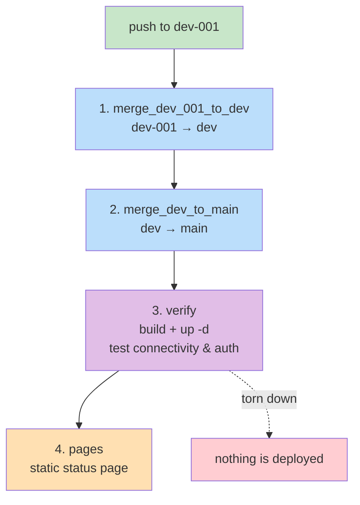

# Application Proxy Server

Prototype: an Apache reverse proxy acting as the sole gateway in front of a small
container cluster, with HTTP basic authentication.

```
proxy (apache2, :2380) ──┬──> reactjs   (nginx, static CRA build)
                         ├──> nodejs    (express API, :3000) ──> mysql (8.0)
                         └──> pma       (phpMyAdmin)         ──> mysql
```

Only `proxy` publishes a host port. The other three are reachable inside the
`prototype_application_proxy` Docker network by container name only.

## Installation

> [!NOTE]
>    Create the network card manually to prevent ip range collision!
> ```shell
> # Create the network card for the dockers
> docker network create -d bridge --subnet 172.70.0.0/24 prototype_application_proxy
> ```

```shell
# Create password for `admin`
# (add further users WITHOUT -c, which would overwrite the file)
htpasswd -c apache/.htpasswd admin
htpasswd    apache/.htpasswd user2
```

```shell
# Build all images, and then run the containers
docker compose build --no-cache
docker compose up -d --force-recreate
```

`.env` is not committed. Create it first:

```shell
cp .env.example .env
```

> [!IMPORTANT]
> The long-term layout moves `docker-compose.yml`, `.env*` and the four service
> directories under `codebase/`. See `AGENTS.md` for the migration notes.

## Endpoints

| Path | Auth | Notes |
|---|---|---|
| `/reactjs/` | basic auth | CRA static build served by nginx |
| `/nodejs/api/health` | **none** | `{status, db}` — proves the API→MySQL link |
| `/nodejs/api/items` | **none** | reads the `items` table |
| `/pma/` | **none** | phpMyAdmin |

Only `/reactjs` is protected. `/pma` and `/nodejs` are currently wide open — this
contradicts the "gateway safeguards everything" goal and is tracked as known debt.
`CI` asserts both the protected and unprotected behaviour so the gap stays visible.

## CI pipeline

A **single** workflow, `.github/workflows/pipeline.yml`, triggered only by a push
to `dev-001`. Every hop is an explicit job dependency inside one run:

| # | Job | What it does |
|---|---|---|
| 1 | `merge_dev_001_to_dev` | merges `dev-001` into `dev`, pushes |
| 2 | `merge_dev_to_main` | merges `dev` into `main`, pushes |
| 3 | `verify` | checks out `main`, builds the images, starts the stack, tests connectivity + auth, tears down |
| 4 | `pages` | publishes a static status page (runs even if `verify` fails) |



The merges used to depend on a push to `dev`/`main` re-triggering a workflow, which
is why a PAT was strictly necessary. Chaining with `needs:` means one run covers
the whole promotion, so it shows up as a single status instead of three.

`verify` runs on a throwaway `ubuntu-latest` runner: it creates the external
network, appends a temporary `ci-user` to `apache/.htpasswd` (the image `COPY`s
that file, so it has to exist before the build), builds, starts the stack, then
asserts:

- `/nodejs/api/health` returns `200` — the API and its MySQL round-trip work
- `/pma/` returns `200`
- `/reactjs/` returns `401` without credentials — the proxy really is a gateway
- `/reactjs/` returns `200` with the throwaway credentials

It needs **no secrets**. MySQL gets an ephemeral password because the data
directory is destroyed at the end of the job.

Deployment to a real host is a separate concern and is deliberately not part of
this pipeline — nothing is published or promoted.

### Status page

`pages` builds a small static page and deploys it with `actions/deploy-pages`.
This is the honest use of GitHub Pages: it serves files only and has no container
runtime, so it reports the verification result rather than hosting anything.
The page is also published when `verify` **fails**, so a red result is visible
instead of leaving the previous green page up.

To enable it: **Settings → Pages → Build and deployment → Source: GitHub Actions**.

### Required repository secret

The two merge jobs push with `secrets.GIT_PUSH_TOKEN`, a fine-grained PAT with
Contents: read+write on this repo. It is still needed to get past branch
protection on `dev` and `main` — `GITHUB_TOKEN` cannot write to protected
branches. The PAT account must be allowed to bypass branch protection.

## Documentation

Full documentation lives under `docbase/`, starting at
[`docbase/TOCTREE.md`](docbase/TOCTREE.md). *(Not yet created — see `AGENTS.md`
for the planned structure and the outstanding migration.)*

Agent-facing conventions, build quirks and known defects are in
[`AGENTS.md`](AGENTS.md). Notable known issues:

- `reactjs/src/index.js` calls `/api/health`, which Apache does not proxy, so the
  on-page health panel never populates.
- `reactjs/package.json` has no `homepage`, so CRA emits absolute `/static/...`
  asset paths that 404 under the `/reactjs` prefix.
- `PMA_ABSOLUTE_URI` in `docker-compose.yml` hardcodes the host `hkss13`.
- `apache/.htpasswd` is tracked in git.
- Neither `package-lock.json` is committed, so image builds are not reproducible.
