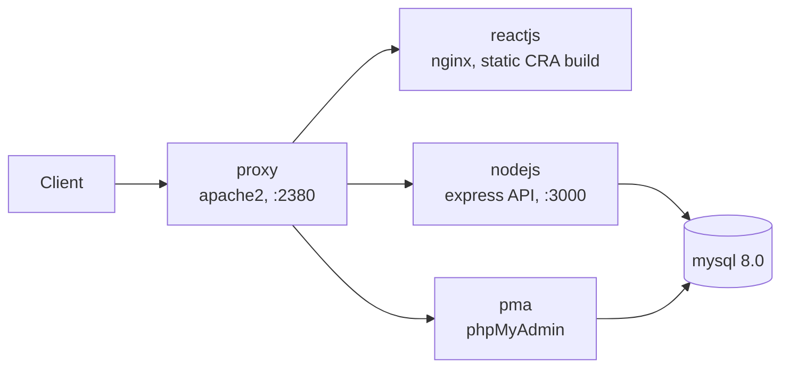
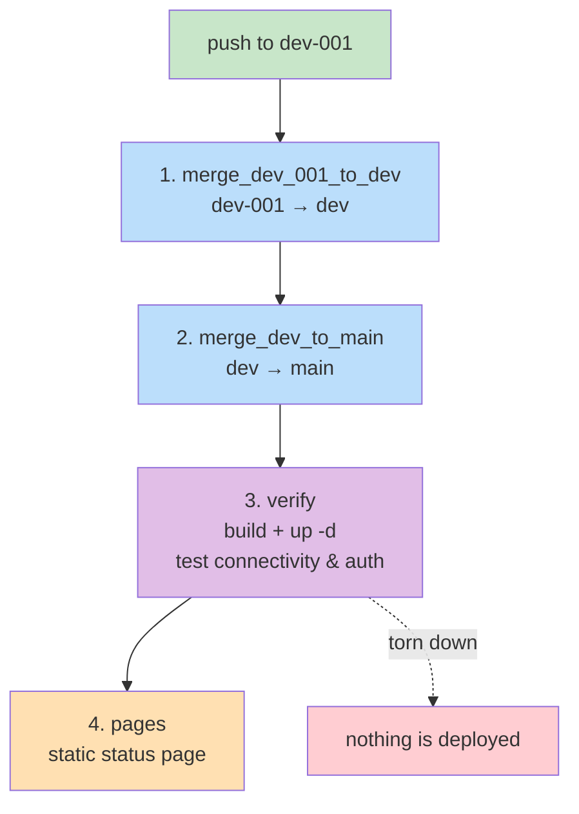

# Application Proxy Server

Prototype: an Apache reverse proxy acting as the sole gateway in front of a small
container cluster, with HTTP basic authentication.


Only `proxy` publishes a host port. The other three are reachable inside the
`prototype_application_proxy` Docker network by container name only.

## Layout

```
codebase/            everything runnable
  docker-compose.yml
  .env.example       copy to .env
  apache/ mysql/ nodejs/ reactjs/
docbase/             all documentation
  TOCTREE.md         start here
  doc/
```

Full documentation: **[`docbase/TOCTREE.md`](docbase/TOCTREE.md)**.
Agent-facing conventions and known defects: [`AGENTS.md`](AGENTS.md).

## Installation

> [!NOTE]
>    Create the network card manually to prevent ip range collision!
> ```shell
> # Create the network card for the dockers
> docker network create -d bridge --subnet 172.70.0.0/24 prototype_application_proxy
> ```

```shell
# .env is not committed
cp codebase/.env.example codebase/.env
```

```shell
# Create the password for `admin`.
# Add further users WITHOUT -c: it truncates the file and destroys every other user.
htpasswd -c codebase/apache/.htpasswd admin
htpasswd    codebase/apache/.htpasswd user2
```

```shell
# Build all images, and then run the containers
cd codebase
docker compose build --no-cache
docker compose up -d --force-recreate
```

Compose must run from inside `codebase/`, or be given
`--project-directory codebase`, so it finds `.env` and resolves the `./apache`
build contexts relative to the Compose file. Full steps and troubleshooting:
[`docbase/doc/QuickStart.md`](docbase/doc/QuickStart.md).

## Endpoints

| Path | Auth | Notes |
|---|---|---|
| `/reactjs/` | basic auth | CRA static build served by nginx |
| `/nodejs/api/health` | **none** | `{status, db}` — proves the API→MySQL link |
| `/nodejs/api/items` | **none** | reads the `items` table |
| `/pma/` | **none** | phpMyAdmin |

Only `/reactjs` is protected. `/pma` and `/nodejs` are currently wide open — this
contradicts the "gateway safeguards everything" goal, and the project requires
two or more users where only one exists. Both are recorded in
[`docbase/doc/RTM.md`](docbase/doc/RTM.md). CI asserts the current behaviour
explicitly so the gap stays visible.

## CI pipeline

A **single** workflow, `.github/workflows/pipeline.yml`, triggered only by a push
to `dev-001`. Every hop is an explicit job dependency inside one run:

| # | Job | What it does |
|---|---|---|
| 1 | `merge_dev_001_to_dev` | merges `dev-001` into `dev`, pushes |
| 2 | `merge_dev_to_main` | merges `dev` into `main`, pushes |
| 3 | `verify` | checks out `main`, builds the images, starts the stack, tests connectivity + auth, tears down |
| 4 | `pages` | publishes a static status page (runs even if `verify` fails) |



The merges used to depend on a push to `dev`/`main` re-triggering a workflow, so
adding a trigger on those branches would now double-merge.

`verify` runs on a throwaway `ubuntu-latest` runner: it creates the external
network, appends a temporary `ci-user` to `codebase/apache/.htpasswd` (the image
`COPY`s that file, so it has to exist before the build), builds, starts the stack,
then asserts:

- `/nodejs/api/health` returns `200` — the API and its MySQL round-trip work
- `/pma/` returns `200`
- `/reactjs/` returns `401` without credentials — the proxy really is a gateway
- `/reactjs/` returns `200` with the throwaway credentials

It needs **no secrets**. MySQL gets an ephemeral password because the data
directory is destroyed at the end of the job.

Deployment to a real host is a separate concern and is deliberately not part of
this pipeline — nothing is published or promoted.

### Status page

`pages` builds a small static page and deploys it with `actions/deploy-pages`.
This is the honest use of GitHub Pages: it serves files only and has no container
runtime, so it reports the verification result rather than hosting anything. The
page is also published when `verify` **fails**, so a red result is visible instead
of leaving the previous green page up.

To enable it: **Settings → Pages → Build and deployment → Source: GitHub Actions**.

### Required repository secret

The two merge jobs push with `secrets.GIT_PUSH_TOKEN`, a fine-grained PAT with
Contents: read+write on this repo. It is still needed to get past branch
protection on `dev` and `main` — `GITHUB_TOKEN` cannot write to protected
branches. The PAT account must be allowed to bypass branch protection.

## Documentation

| Document | Purpose |
|---|---|
| [ProjectCharter](docbase/doc/ProjectCharter.md) | Why it exists, scope, success criteria |
| [PRD](docbase/doc/PRD.md) | User-facing requirements and current conformance |
| [SRS](docbase/doc/SRS.md) | Numbered, testable requirements |
| [ADR](docbase/doc/ADR.md) | Architecture decision records |
| [Architecture](docbase/doc/Architecture.md) | Topology, request flow, known issues |
| [API](docbase/doc/API.md) | HTTP surface and auth matrix |
| [Schema](docbase/doc/Schema.md) | Database schema and seed data |
| [ERD](docbase/doc/ERD.md) | Entity relationships and access paths |
| [QuickStart](docbase/doc/QuickStart.md) | Running the stack from scratch |
| [RTM](docbase/doc/RTM.md) | Requirement → implementation → test |
| [CRM](docbase/doc/CRM.md) | Cross-reference matrix across requirements, code, docs and tests |
| [Configuration & Settings](docbase/doc/Configuration&Settings.md) | Every variable, name and CI setting |

## Known issues

Full detail in [`AGENTS.md`](AGENTS.md) and
[`docbase/doc/Architecture.md`](docbase/doc/Architecture.md#known-issues).

- `codebase/reactjs/src/index.js` calls `/api/health`, which Apache does not
  proxy, so the on-page health panel never populates.
- `codebase/reactjs/package.json` has no `homepage`, so CRA emits absolute
  `/static/...` asset paths that 404 under the `/reactjs` prefix.
- `PMA_ABSOLUTE_URI` in `codebase/docker-compose.yml` hardcodes the host
  `hkss13`, so phpMyAdmin redirects break on any other hostname.
- `codebase/apache/.htpasswd` is tracked in git.
- Only one user exists; the project requires two or more.
- Neither `package-lock.json` is committed, so image builds are not reproducible.
- `codebase/nodejs/` has no `.dockerignore`, so `COPY . .` would copy a local
  `node_modules` or `.env` into the image.
