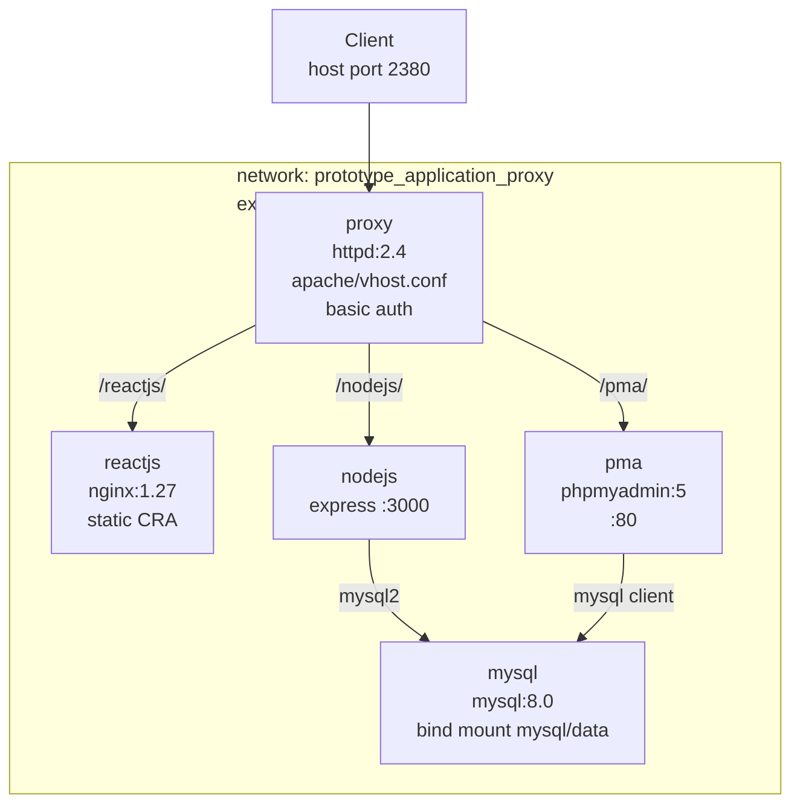
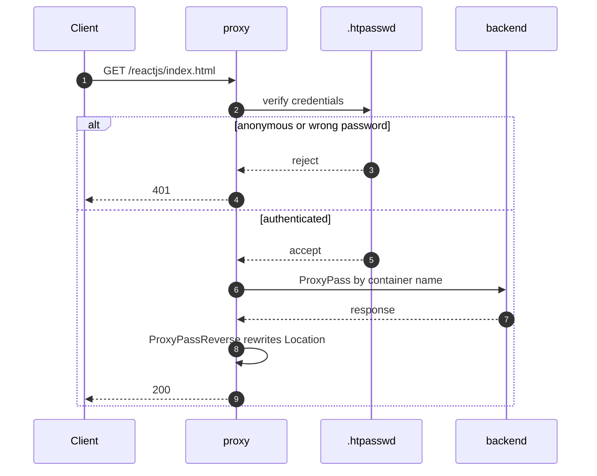

# Architecture

## Topology

Only `proxy` publishes a host port. Every other service uses `expose:`, which
documents intent without opening a route from the host.

## Request flow

The auth block is per-`<Location>`; only `/reactjs` has one today, so the other
routes take the `else` branch without the credential check. `ProxyPassReverse`
is what makes phpMyAdmin redirects resolve through the proxy instead of naming a
container. A request for exactly `/` is redirected to `/reactjs/`.

`ProxyRequests Off` is set, so the proxy is not usable as a forward proxy.

## Components

### proxy

`codebase/apache/` — image `prototype-application-proxy:latest`, built from
`httpd:2.4`. The Dockerfile uncomments the required modules in `httpd.conf` with
`sed`, copies `vhost.conf` to `conf/extra/`, copies `.htpasswd` into `conf/`, and
appends an `Include` line so the virtual host loads. Because `httpd.conf` is
appended to rather than replaced, the base image's default `Listen 80` remains and
no vhost needs removing.

### reactjs

`codebase/reactjs/` — two-stage build. `react-scripts build` produces static
output in a Node stage; the runtime image is `nginx:1.27-alpine` serving it, with
`try_files … /index.html` so client-side routes resolve. The `nginx.conf` also
exposes `/healthz` returning a plain `200`, which is internal to the container and
not routed by the proxy.

### nodejs

`codebase/nodejs/` — Express on port 3000 with a `mysql2/promise` connection
pool of ten connections. Reads `DB_HOST`, `DB_PORT`, `DB_USER`, `DB_PASS` and
`DB_NAME` from the environment, which the Compose file populates from the
`MYSQL_*` variables. Endpoints are listed in [API.md](API.md).

### pma

`codebase/phpmyadmin` image `phpmyadmin:5-apache`, pointed at the `mysql`
container by `PMA_HOST`.

### mysql

`codebase/mysql/` — `mysql:8.0` with a healthcheck, and a bind mount to
`mysql/data` for persistence. `init.sql` is mounted into
`/docker-entrypoint-initdb.d/`, which the image only executes **when the data
directory is empty**. See the gotcha below.

## Start ordering

`nodejs` and `pma` both declare `depends_on: mysql: condition:
service_healthy`. Compose therefore blocks until MySQL answers its healthcheck
before starting them, which prevents a first-run crash from an immediate
connection attempt. The `proxy` depends on all three applications.

## Known issues

These are real defects in the current build, not plans.

**The React health panel cannot populate.** `codebase/reactjs/src/index.js`
fetches `/api/health`, but the proxy only routes `/nodejs`, `/pma` and `/reactjs`.
There is no `/api` route, and the frontend's own nginx has no `/api` location
either. The request falls through to the proxy's default document root and 404s.
Fix by fetching `/nodejs/api/health`, or by adding a `ProxyPass /api`.

**Static assets 404 under the `/reactjs` prefix.**
`codebase/reactjs/package.json` has no `homepage` field, so the build emits
absolute `/static/...` references. The proxy does not route `/static`, so they
404. Setting `"homepage": "."` or `"/reactjs"` makes them relative.

**`PMA_ABSOLUTE_URI` hardcodes a hostname.** It is set to
`http://hkss13:2380/pma/`, so phpMyAdmin's own redirects point at that host
regardless of how the stack is reached. This will surface as a CI failure on
`/pma/` if the assertion follows a redirect.

**Builds are not reproducible.** Neither `package-lock.json` is committed, and
both Dockerfiles run `npm install` rather than `npm ci`.

**`codebase/nodejs/` has no `.dockerignore`.** `COPY . .` will copy a local
`node_modules` or a stray `.env` into the image. `codebase/reactjs/` has one.

## Related documents

[API.md](API.md) · [Schema.md](Schema.md) · [ADR.md](ADR.md) ·
[CRM.md](CRM.md) · [Configuration&Settings.md](Configuration&Settings.md)
