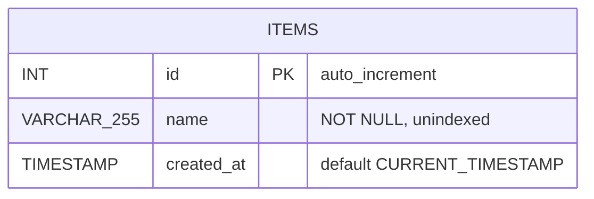
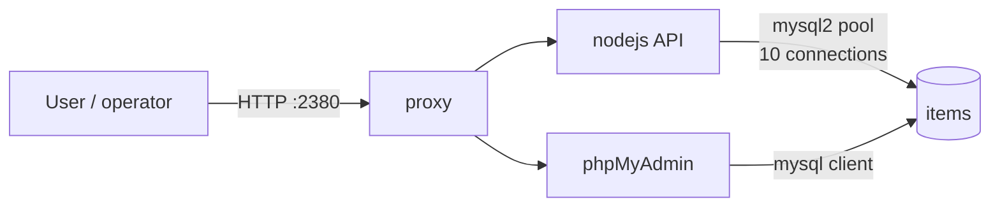
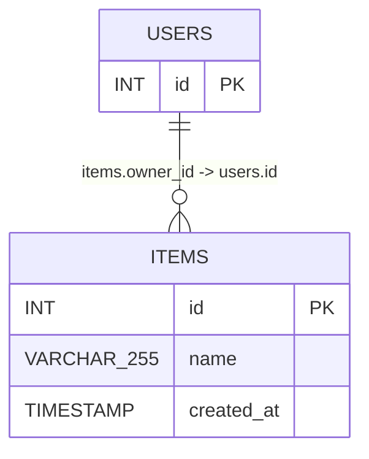

# Entity-Relationship Diagram

## Current model

The schema contains exactly one table and therefore exactly one entity. There
are no relationships to draw — no foreign keys, no joins, no junction tables.

## Cardinality

Not applicable. With a single entity there is nothing to relate it to.

## Access paths

Two independent clients read the same table, and neither writes to it:

| Path | Route | Auth |
|---|---|---|
| Programmatic | `GET /nodejs/api/items` → `SELECT * FROM items` | none |
| Interactive | `/pma/` → phpMyAdmin | none |

Both are read-only against `items`. There is no write endpoint in the API, so
phpMyAdmin is currently the only way to modify data.

## Implied extension

The `items` table is a placeholder so the API and the database link have
something real to exercise. If the prototype grows, the natural first
relationship is ownership or authorship:

`USERS` is hypothetical; the relationship above is what the prototype would
grow into, not what it has. Adopting it would require a `users` table, a foreign
key, and an index on `items.owner_id`. None of that exists today, and it is not
in scope — see [ProjectCharter.md](ProjectCharter.md#scope).

## Related documents

[Schema.md](Schema.md) · [API.md](API.md) · [Architecture.md](Architecture.md)
